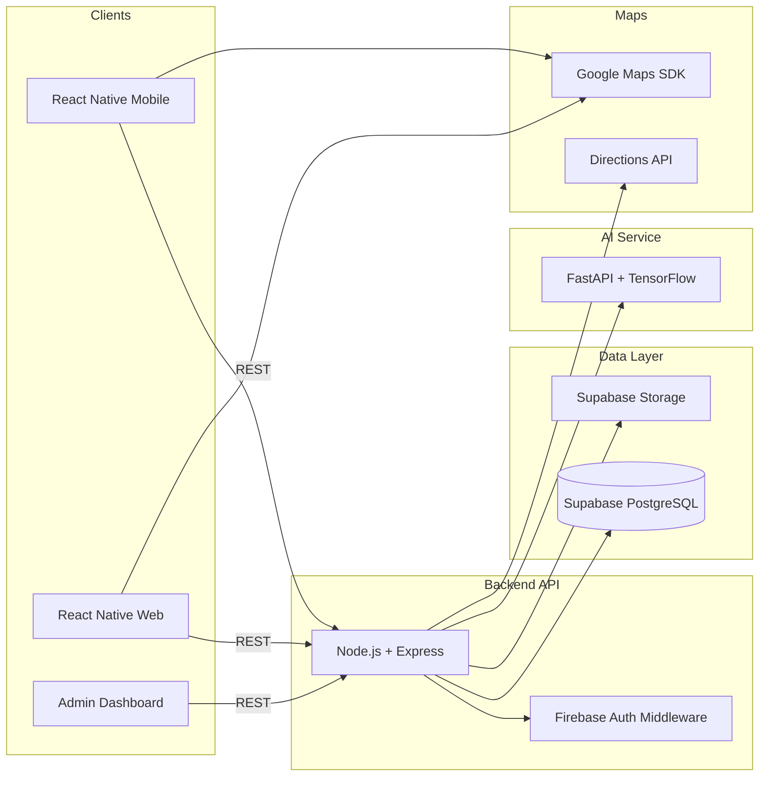

# Incredible Karnataka — Full Phased Specification

Date: March 10, 2026

This document consolidates all phases and required outputs for the **Incredible Karnataka** platform.

---

## PHASE 1 — Project Architecture & System Design

### 1.1 Overall System Architecture (High Level)
**Components**
1. **Mobile App (React Native + Redux)**
2. **Web App (React Native Web + Redux)**
3. **Backend API (Node.js + Express)**
4. **Database (Supabase PostgreSQL + Storage)**
5. **AI Service (TensorFlow served via FastAPI)**
6. **Maps Layer (Google Maps SDK + Directions API)**
7. **Admin Dashboard (React Web)**

### 1.2 How Components Interact
- **Mobile/Web apps** call the **Backend API** via HTTPS.
- **Backend** verifies Firebase Auth tokens.
- **Backend** reads/writes data in **Supabase Postgres** and **Supabase Storage**.
- **Backend** requests **AI recommendations, sentiment, and itinerary** from the **AI Service**.
- **Mobile/Web** use **Google Maps SDK** for map rendering; **Backend** calls **Directions API** for routing/ETAs.
- **Admin Dashboard** uses the same Backend API with admin scopes.

### 1.3 System Architecture Diagram


### 1.4 Project Folder Structures

**Frontend (mobile + web)**
```
IncredibleKarnataka/
  mobile/
    src/
      navigation/
      screens/
      components/
      store/
      services/
      hooks/
      theme/
      utils/
  web/
    src/
      navigation/
      screens/
      components/
      store/
      services/
      hooks/
      theme/
      utils/
```

**Backend**
```
IncredibleKarnataka/
  backend/
    src/
      app.ts
      server.ts
      config/
      routes/
      controllers/
      services/
      middleware/
      models/
      validations/
      utils/
      types/
```

### 1.5 Database Schema (High Level)
Tables:
- Users
- Places
- Categories
- Reviews
- SavedPlaces
- Photos
- Admin

---

## PHASE 2 — Database Design (Supabase PostgreSQL)

```sql
-- Users
CREATE TABLE users (
  id UUID PRIMARY KEY DEFAULT gen_random_uuid(),
  name TEXT NOT NULL,
  email TEXT UNIQUE NOT NULL,
  password TEXT,
  created_at TIMESTAMP WITH TIME ZONE DEFAULT NOW()
);

-- Categories
CREATE TABLE categories (
  id UUID PRIMARY KEY DEFAULT gen_random_uuid(),
  category_name TEXT UNIQUE NOT NULL
);

-- Places
CREATE TABLE places (
  id UUID PRIMARY KEY DEFAULT gen_random_uuid(),
  name TEXT NOT NULL,
  description TEXT,
  category UUID REFERENCES categories(id),
  latitude DOUBLE PRECISION NOT NULL,
  longitude DOUBLE PRECISION NOT NULL,
  authenticity_score NUMERIC(4,2) DEFAULT 0,
  verified BOOLEAN DEFAULT FALSE,
  created_at TIMESTAMP WITH TIME ZONE DEFAULT NOW()
);

-- Reviews
CREATE TABLE reviews (
  id UUID PRIMARY KEY DEFAULT gen_random_uuid(),
  user_id UUID REFERENCES users(id) ON DELETE CASCADE,
  place_id UUID REFERENCES places(id) ON DELETE CASCADE,
  rating NUMERIC(2,1) CHECK (rating >= 0 AND rating <= 5),
  review_text TEXT,
  sentiment_score NUMERIC(4,2) DEFAULT 0,
  created_at TIMESTAMP WITH TIME ZONE DEFAULT NOW()
);

-- Saved Places
CREATE TABLE saved_places (
  id UUID PRIMARY KEY DEFAULT gen_random_uuid(),
  user_id UUID REFERENCES users(id) ON DELETE CASCADE,
  place_id UUID REFERENCES places(id) ON DELETE CASCADE,
  UNIQUE (user_id, place_id)
);

-- Photos
CREATE TABLE photos (
  id UUID PRIMARY KEY DEFAULT gen_random_uuid(),
  place_id UUID REFERENCES places(id) ON DELETE CASCADE,
  image_url TEXT NOT NULL
);

-- Admin
CREATE TABLE admin (
  id UUID PRIMARY KEY DEFAULT gen_random_uuid(),
  name TEXT NOT NULL,
  email TEXT UNIQUE NOT NULL
);

-- Indexes
CREATE INDEX idx_places_geo ON places (latitude, longitude);
CREATE INDEX idx_reviews_place ON reviews (place_id);
CREATE INDEX idx_saved_user ON saved_places (user_id);
```

---

## PHASE 3 — Backend Development (Node.js + Express)

### REST APIs
**Users**
- `POST /users/register`
- `POST /users/login`
- `GET /users/profile`

**Places**
- `GET /places/nearby?lat=...&lng=...&radius=...&category=...`
- `GET /places/:id`
- `POST /places` (admin approval required)

**Reviews**
- `POST /reviews`
- `GET /reviews/:placeId`
- `DELETE /reviews/:id` (admin)

**Saved Places**
- `POST /saved`
- `DELETE /saved/:placeId`
- `GET /saved`

**Admin**
- `POST /admin/places/:id/approve`
- `PATCH /admin/places/:id`
- `DELETE /admin/reviews/:id`
- `POST /admin/categories`
- `DELETE /admin/categories/:id`

### Security
- Firebase Auth middleware to validate tokens and add user context.
- Role-based checks for admin endpoints.

### Validation + Error Handling
- Input validation via schema layer.
- Central error middleware with consistent error format.

---

## PHASE 4 — Mobile App Development (React Native + Redux)

**Screens**
1. Onboarding
2. Login / Signup
3. Home + Map
4. Category Filter
5. Place Details
6. Review Submission
7. Saved Places
8. AI Itinerary Planner

**Features**
- Auto-detect user location
- Nearby places list
- Category filters
- Save places, upload reviews/photos, suggest new place
- Redux slices: auth, places, reviews, saved, itinerary, location

---

## PHASE 5 — Google Maps Integration

**Features**
1. Real-time user location
2. Markers for nearby places
3. Marker detail popup (name, rating, category)
4. Category filters on map
5. Directions API for routes
6. Display distance + ETA

---

## PHASE 6 — AI Recommendation System

**Model**
- Hybrid: Collaborative Filtering + Content-Based

**Inputs**
- user location
- saved places
- ratings
- reviews
- categories

**API Endpoint**
- `POST /ai/recommendations`

---

## PHASE 7 — Sentiment Analysis

**Steps**
1. Preprocess review text
2. Train NLP model
3. Classify: Positive / Neutral / Negative

**Outputs**
- Store sentiment score per review
- Aggregate sentiment score per place

---

## PHASE 8 — AI Itinerary Generator

**Inputs**
- user location
- available travel time
- selected categories
- distance limits

**Outputs**
- Ranked schedule with route optimization

Example:
- 9:00 AM – Visit temple
- 11:00 AM – Local breakfast
- 1:00 PM – Hidden lake
- 4:00 PM – Historical fort

---

## PHASE 9 — Admin Dashboard

**Capabilities**
- Approve user-submitted places
- Edit place info
- Delete fake reviews
- Manage categories
- Monitor users

**Stack**
- React web + Node.js backend

---

## PHASE 10 — Offline Support & Deployment

### Offline Support
- Cache nearby places locally
- View saved places offline
- Store last-known map data

### Deployment
**Backend**
- Deploy Node.js API to AWS/GCP

**Database**
- Supabase Postgres

**AI Service**
- FastAPI + TensorFlow

**Mobile**
- Build Android APK with Expo/EAS

---

## Final Deliverables (End of All Phases)
- System architecture diagram
- Database schema
- Backend folder structure
- Frontend folder structure
- API documentation
- TensorFlow AI model implementation
- Deployment guide
```
